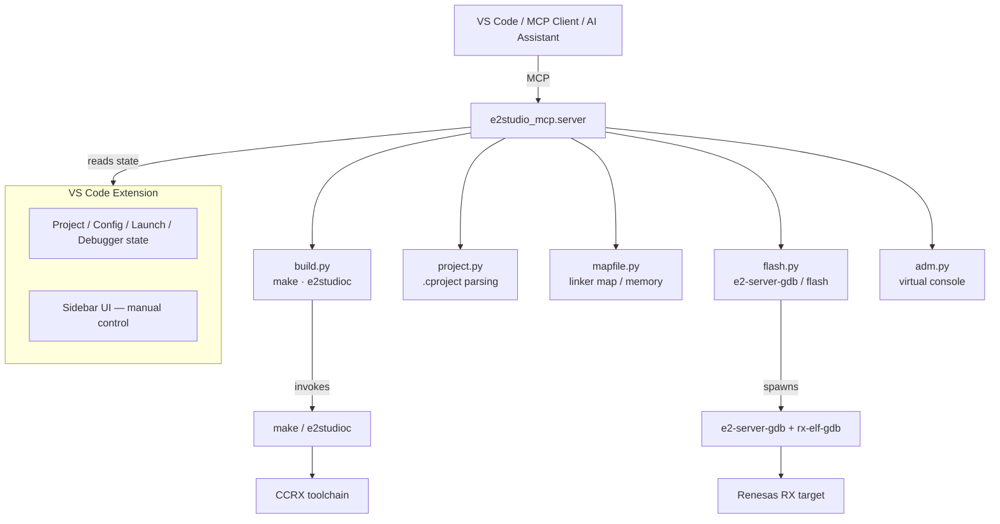

# E2 MCP for Renesas RX

E2 MCP is an MCP server and VS Code integration layer for Renesas RX development with e2 Studio.

It is built for a practical workflow:

- an MCP client or AI assistant can build, inspect, flash, debug and read target output
- VS Code keeps the selected project, build configuration, launch file and debugger grounded in the real workspace
- the optional sidebar gives the user manual control over the exact same operations

The result is a single execution path for both human-driven and MCP-driven firmware work.

## What This Repository Contains

This repository is split into two cooperating parts:

- `src/e2studio_mcp/`: the Python MCP server that exposes tools and resources
- `vscode-extension/`: the VS Code extension that anchors Renesas project state and hardware actions inside the editor

If you only look at the extension, you miss the MCP server.

If you only look at the MCP server, you miss the editor-side state that makes build, flash and debug reliable.

## MCP-First Workflow

E2 MCP is not designed as a generic build helper with an AI layer added later.

The intended flow is:

1. Open a Renesas workspace in VS Code
2. Let the extension detect or load the toolchain and available projects
3. Select the active project, build configuration, launch file and debugger once
4. Use MCP tools to build, inspect memory, flash firmware, start debug or read the ADM console
5. Fall back to the sidebar whenever you want direct manual control

That keeps the MCP client aligned with the same project state the user sees in the editor.

## Core Capabilities

- Build e2 Studio projects through `make` or `e2studioc`
- Discover projects and parse `.cproject` metadata
- Read linker `.map` files and compute ROM, RAM and DataFlash usage
- Start or stop Renesas debug sessions through the VS Code extension
- Flash `.mot` output using the Renesas debug stack
- Capture ADM virtual console output from the target
- Expose all of the above as MCP tools and resources

## Architecture



## MCP Tools

### Build

- `build_project(project?, config?, mode?)`
- `clean_project(project?, config?, mode?)`
- `rebuild_project(project?, config?, mode?)`
- `get_build_status(project?)`

### Project And Memory

- `list_projects()`
- `get_project_config(project?, config?)`
- `get_build_size(project?, config?)`
- `get_map_summary(project?, config?)`
- `get_linker_sections(project?, config?)`

### Flash And Debug

- `debug_start(project?)`
- `debug_stop()`
- `debug_status()`
- `get_adm_log(port?, wait_seconds?, duration_ms?, poll_ms?, max_bytes?)`

## MCP Resources

- `e2studio://build/log`
- `e2studio://debug/adm/log`
- `e2studio://project/memory`
- `e2studio://project/config`
- `e2studio://activity/log`

## VS Code Extension

The extension in `vscode-extension/` is the editor-side control plane for the MCP workflow.

It provides:

- project selection
- build configuration selection
- launch file selection
- debugger selection
- manual Build, Clean, Rebuild, Flash, Debug and Stop actions
- virtual console output access
- workspace-aware state that MCP clients can reuse safely

The current Marketplace-facing README for the extension lives in `vscode-extension/README.md`.

## Requirements

- Windows
- Python `>= 3.10`
- Renesas e2 Studio installed
- Renesas RX toolchain available: `CCRX`, `make`, `e2-server-gdb`, `rx-elf-gdb`
- A workspace containing Renesas e2 Studio projects with `.cproject` files
- For VS Code debug integration: `renesaselectronicscorporation.renesas-debug`

## Repository Layout

```text
e2studio-mcp/
  src/e2studio_mcp/
    server.py
    build.py
    project.py
    mapfile.py
    flash.py
    adm.py
    config.py
  tests/
  scripts/
  vscode-extension/
```

## Install The Python Server

```powershell
cd e2Studio_2024_workspace/e2studio-mcp
py -3 -m pip install -e .
```

Optional development dependencies:

```powershell
py -3 -m pip install -e .[dev]
```

## Configuration

No configuration file is needed. All settings come from **VS Code settings** (`e2mcp.*`) and **auto-detection**.

### VS Code Settings

| Setting | Default | Description |
|---------|---------|-------------|
| `e2mcp.workspace` | `""` | Root folder containing e2 Studio projects |
| `e2mcp.defaultProject` | `""` | Default project name |
| `e2mcp.buildConfig` | `HardwareDebug` | Build configuration |
| `e2mcp.buildMode` | `make` | Build backend: `make` or `e2studioc` |
| `e2mcp.buildJobs` | `0` | Parallel jobs (`0` = auto, max 16) |
| `e2mcp.e2studioPath` | auto | Path to e2 Studio `eclipse` folder |
| `e2mcp.ccrxPath` | auto | Path to CCRX compiler `bin` folder |
| `e2mcp.makePath` | auto | Path to GNU Make folder |
| `e2mcp.debugToolsPath` | auto | Path to `DebugComp/RX` folder |
| `e2mcp.python3BinPath` | auto | Path to Renesas embedded Python3 |

### MCP Server Environment Variables

When running the Python server standalone (without the extension), pass settings via environment variables:

| Variable | Maps to |
|----------|---------|
| `E2MCP_WORKSPACE` | `e2mcp.workspace` |
| `E2MCP_PROJECT` | `e2mcp.defaultProject` |
| `E2MCP_BUILD_CONFIG` | `e2mcp.buildConfig` |
| `E2MCP_BUILD_MODE` | `e2mcp.buildMode` |
| `E2MCP_BUILD_JOBS` | `e2mcp.buildJobs` |
| `E2MCP_E2STUDIO_PATH` | `e2mcp.e2studioPath` |
| `E2MCP_CCRX_PATH` | `e2mcp.ccrxPath` |
| `E2MCP_MAKE_PATH` | `e2mcp.makePath` |

Toolchain paths are auto-detected from standard Renesas install locations if not set. Flash/debug parameters come from e2 Studio `.launch` files. Known devices (RX651, RX65N, RX72N) are built-in.

## Run The MCP Server

```powershell
cd e2Studio_2024_workspace/e2studio-mcp
py -3 -m e2studio_mcp.server
```

Or:

```powershell
py -3 -m e2studio_mcp
```

## Extension Build

```powershell
cd e2Studio_2024_workspace/e2studio-mcp/vscode-extension
npm install
npm run compile
```

## Testing

Run unit tests:

```powershell
cd e2Studio_2024_workspace/e2studio-mcp
py -3 -m pytest -q
```

## License

Proprietary. See `LICENSE.txt`.

```powershell
cd e2Studio_2024_workspace/e2studio-mcp
py -3 tests/smoke_test.py
```

## Troubleshooting

- `make not found`: set `e2mcp.makePath` in VS Code settings.
- `sed`, `ccrx` o `renesas_cc_converter` no encontrados durante `make`: comprobar `e2mcp.e2studioPath` y `e2mcp.ccrxPath`.
- `e2studioc not found`: comprobar `e2mcp.e2studioPath` apuntando a `.../eclipse`.
- `Cannot find e2-server-gdb`: set `e2mcp.debugToolsPath` in VS Code settings.
- `No .launch file found`: create a debug launch configuration in e2 Studio first.
- `No .mot file found`: compilar antes de grabar.
- `Cannot connect to e2-server-gdb`: verificar sonda, dispositivo configurado y puerto GDB.

## Licencia

Software propietario. Todos los derechos reservados.

El código fuente de este repositorio no concede permiso de redistribución, sublicencia ni explotación comercial.
La metadata del paquete de extensión referencia la licencia incluida en [vscode-extension/LICENSE.txt](vscode-extension/LICENSE.txt).
